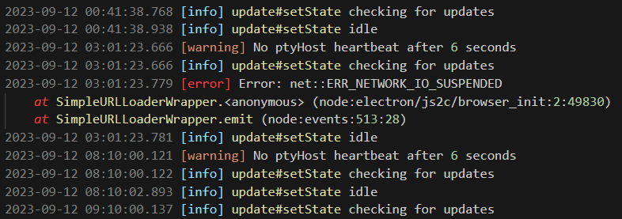
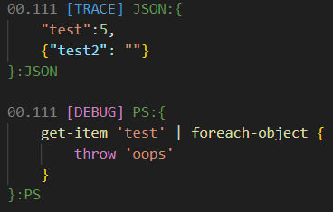

# Crisp Logs


Crisp Logs provides a better default log highlighting experience, both for log files and for the vscode output window.

This extension replaces the default builtin logging highlighter for VSCode. It is optimized for logs that follow a format of "timestamp severity message" format.




## Customization

The included colors are optimized for the Default Dark and Light themes and generally use appropriate tokens where possible, however the individual highlighting tokens are fully customizable to whatever preferred colors you want using the following settings:

```jsonc
"editor.tokenColorCustomizations": {
  "[Default Dark+ Experimental]": { #Replace with your your preferred theme or leave empty for all themes
    "textMateRules": [
      {
        "scope": ["log.warning"], #Replace with the token you want to adjust
        "settings": {"foreground": "#9CDCFE"}
      }
    ]
  }
}
```

You can also specify a parent of a token to affect all tokens of that type. For instance, `log.string` will color all log strings regardles of if they are single or double quoted.

### Available tokens

- `log.timestamp`
- `log.function`
- `log.silly`
- `log.trace`
- `log.debug`
- `log.info`
- `log.verbose`
- `log.warning`
- `log.error`
- `log.fatal`
- `log.constant.git.commitid`
- `log.constant.guid`
- `log.constant.numeric`
- `log.constant.language`
- `log.constant.hex`
- `log.constant.sha256`
- `log.constant.macaddress`
- `log.path.windows`
- `log.path.uri`
- `log.string.double`
- `log.string.single`
- `log.exception.function`
- `log.exceptiontype`

Git Log Specific:

- `log.function`


## Embedded Highlighting

This extension contains support for embedded highlighting, however matching JSON or PowerShell blocks with regex is notoriously complicated. There is support for a `JSON:` tag that, if you add to your logging, you will get proper highlighting

```
JSON:{
  "your-json-here": "ok"
}
```

### Example



Currently supported tags:

- `JSON:{}`
- `YAML:{}`
- `PS:{}`

### Further log examples

## Development


This uses several rules inspired by the [Log File Highlighter](https://marketplace.visualstudio.com/items?itemName=emilast.LogFileHighlighter) extension, but by using a YAML template format used by the Typescript TextMate syntax, which has a build script for variables and de-duplication that has been adapted for this purpose that makes authoring the complicated required regexes more manageable


To build the extension:


- ensure you have `pnpm` installed
- run `pnpm install --frozen-lockfile`
- Optional: Run `pnpm grammar` to build the json tmlangauge template from the YAML definition
- run `pnpm build` to build the vsix extension

